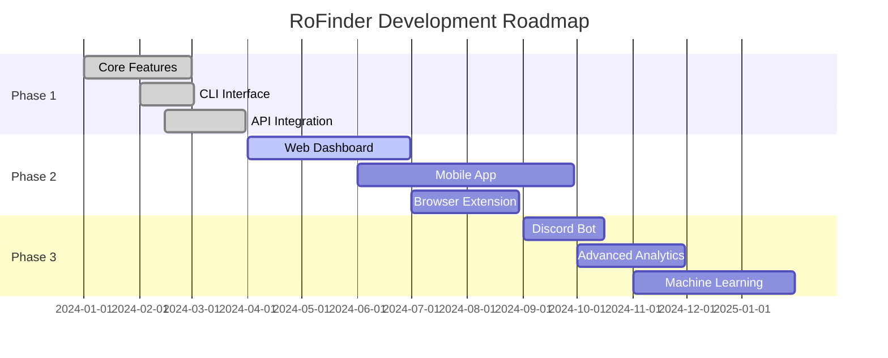

<div align="center">

# RoFinder


<p align="center">
  
</p>

<p align="center">
  <a href="https://github.com/robloxenjoyer124/rofinder/releases">
    
  </a>
  <a href="https://github.com/robloxenjoyer124/rofinder/stargazers">
    
  </a>
  <a href="https://github.com/robloxenjoyer124/rofinder/network/members">
    
  </a>
  <a href="https://github.com/robloxenjoyer124/rofinder/blob/main/LICENSE">
    
  </a>
</p>

<p align="center">
  <a href="https://github.com/robloxenjoyer124/rofinder/issues">
    
  </a>
  <a href="https://github.com/robloxenjoyer124/rofinder/releases">
    
  </a>
  <a href="https://github.com/robloxenjoyer124/rofinder/graphs/contributors">
    
  </a>
  <a href="https://github.com/robloxenjoyer124/rofinder/commits/main">
    
  </a>
</p>

<p align="center">
  
  
  
  
</p>

<p align="center">
  <a href="#installation"><kbd> <br> Installation <br> </kbd></a>&ensp;&ensp;
  <a href="#usage"><kbd> <br> Usage <br> </kbd></a>&ensp;&ensp;
  <a href="#features"><kbd> <br> Features <br> </kbd></a>&ensp;&ensp;
  <a href="#contributing"><kbd> <br> Contributing <br> </kbd></a>&ensp;&ensp;
  <a href="#support"><kbd> <br> Support <br> </kbd></a>
</p>


</div>

<br>

## About RoFinder


<table>
<tr>
<td width="60%">

**RoFinder** is a lightning-fast, feature-rich command-line tool designed to fetch comprehensive information about any Roblox user. Whether you're a developer, researcher, or power user, RoFinder provides instant access to user profiles, statistics, gaming activity, and much more.

Built with performance and simplicity in mind, RoFinder leverages the official Roblox API to deliver accurate data in milliseconds while maintaining a beautiful, intuitive interface.

</td>
<td width="40%">

```
╔═══════════════════════════╗
║   Why Choose RoFinder?    ║
╠═══════════════════════════╣
║ ⚡ Lightning Fast          ║
║ 🎨 Beautiful CLI           ║
║ 🔒 100% Secure             ║
║ 🆓 Forever Free            ║
║ 📦 No Dependencies Hell    ║
║ 🌐 Cross-Platform          ║
║ 🎯 Always Accurate         ║
╚═══════════════════════════╝
```

</td>
</tr>
</table>

<br>

## Features


<details open>
<summary><b>User Profile Intelligence</b></summary>
<br>

<table>
<tr><td>

- Username & User ID lookup with validation
- Account creation date & precise age calculation
- Bio, description, and about section
- Display names & profile URL generation
- Account status detection (active, banned, deleted)
- Roblox Premium status with subscription details
- Verified badge status checking
- Privacy settings analysis
- Account reputation scoring

</td></tr>
</table>

</details>

<details open>
<summary><b>Statistics & Analytics</b></summary>
<br>

<table>
<tr><td>

- Complete friends list with export options
- Real-time follower & following counts
- Total badges earned with categories
- Games played history with timestamps
- Place visits statistics and trends
- Limited items owned with RAP values
- Estimated account value calculation
- Growth trends and analytics
- Engagement rate metrics

</td></tr>
</table>

</details>

<details open>
<summary><b>Gaming Activity Tracking</b></summary>
<br>

<table>
<tr><td>

- Currently playing game detection
- Comprehensive game history
- Last online timestamp with timezone
- Favorite games with playtime
- Achievement tracking across games
- Group memberships with roles
- Game badges collection
- Recently played games feed
- Gaming session analytics

</td></tr>
</table>

</details>

<details open>
<summary><b>Avatar & Appearance Analysis</b></summary>
<br>

<table>
<tr><td>

- Current outfit & equipped items
- Avatar thumbnails (multiple resolutions)
- Complete wearing items catalog
- Avatar value calculation
- Color scheme extraction
- 3D avatar preview URLs
- Item purchase history
- Outfit change tracking
- Asset rarity detection

</td></tr>
</table>

</details>

<details open>
<summary><b>Advanced Features</b></summary>
<br>

<table>
<tr><td>

- Batch user lookup (process hundreds simultaneously)
- Export to JSON, CSV, XML, YAML formats
- Custom output themes and styling
- Multi-user comparison reports
- Username history tracking
- RESTful API integration support
- Intelligent caching system
- Proxy support for privacy
- Real-time status monitoring
- Webhook notifications
- Rate limiting protection
- Error recovery mechanisms

</td></tr>
</table>

</details>

<br>

## Installation


<div align="center">

### Choose Your Installation Method

<table>
<tr>
<td align="center" width="33%">


**PyPI (Recommended)**

```bash
pip install rofinder
```

Best for Python users<br>
Auto-updates available<br>
All features included

</td>
<td align="center" width="33%">


**From Source**

```bash
git clone https://github.com/
robloxenjoyer124/rofinder.git
cd rofinder
pip install -r requirements.txt
python setup.py install
```

Latest development build<br>
Contribution-friendly<br>
Full source access

</td>
<td align="center" width="33%">


**Standalone Binary**

[Download for your OS](#binaries)

No Python required<br>
Ready to use<br>
Portable & lightweight

</td>
</tr>
</table>

</div>

### Binaries

<div align="center">

| Platform | Architecture | Download Link | Size |
|:--------:|:------------:|:-------------:|:----:|
|  Windows | x64 | [rofinder-windows-x64.exe](https://github.com/robloxenjoyer124/rofinder/releases/latest/download/rofinder-windows-x64.exe) | ~12 MB |
|  Windows | ARM64 | [rofinder-windows-arm64.exe](https://github.com/robloxenjoyer124/rofinder/releases/latest/download/rofinder-windows-arm64.exe) | ~11 MB |
|  macOS | Intel | [rofinder-macos-intel](https://github.com/robloxenjoyer124/rofinder/releases/latest/download/rofinder-macos-intel) | ~11 MB |
|  macOS | Apple Silicon | [rofinder-macos-arm64](https://github.com/robloxenjoyer124/rofinder/releases/latest/download/rofinder-macos-arm64) | ~10 MB |
|  Linux | x64 | [rofinder-linux-x64](https://github.com/robloxenjoyer124/rofinder/releases/latest/download/rofinder-linux-x64) | ~13 MB |
|  Linux | ARM64 | [rofinder-linux-arm64](https://github.com/robloxenjoyer124/rofinder/releases/latest/download/rofinder-linux-arm64) | ~12 MB |

</div>

### Quick Verification

```bash
rofinder --version
rofinder --help
rofinder --check-updates
```

<br>

## Usage


### Basic Commands

```bash
# Simple username lookup
rofinder Builderman

# Lookup by User ID
rofinder --id 156

# Get detailed information
rofinder Builderman --detailed

# Show avatar information
rofinder Builderman --avatar

# Display friends list
rofinder Builderman --friends --limit 50

# Show game activity
rofinder Builderman --games --history
```

### Advanced Usage

```bash
# Batch lookup multiple users
rofinder user1 user2 user3 --batch --parallel

# Export to different formats
rofinder Builderman --output json --save results.json
rofinder Builderman --output csv --save data.csv
rofinder Builderman --output yaml --save config.yaml

# Monitor user in real-time
rofinder Builderman --monitor --interval 30 --notify

# Compare multiple users
rofinder user1 user2 user3 --compare --chart

# Custom theme
rofinder Builderman --theme cyberpunk

# Proxy support
rofinder Builderman --proxy http://proxy.example.com:8080

# Detailed logging
rofinder Builderman --verbose --log-file rofinder.log

# Search by criteria
rofinder --search "premium:true followers:>10000"

# Generate report
rofinder Builderman --report --format pdf
```

### Output Themes

```bash
# Available themes
rofinder user --theme <theme>
```

**Themes:** `default` `minimal` `cyberpunk` `matrix` `neon` `retro` `ocean` `forest` `dracula` `monokai` `nord`

<br>

## Configuration


Create `~/.rofinderrc` or `config.yml`:

```yaml
# API Settings
api:
  base_url: "https://api.roblox.com"
  timeout: 15
  retries: 3
  rate_limit: 60
  user_agent: "RoFinder/2.1.0"
  parallel_requests: true

# Display Options
output:
  format: "table"
  theme: "cyberpunk"
  colors: true
  unicode: true
  timestamps: true
  animations: true
  show_tips: true

# Cache Configuration
cache:
  enabled: true
  directory: "~/.rofinder/cache"
  ttl: 3600
  max_size: 100
  compression: true

# Advanced Settings
advanced:
  max_workers: 10
  log_level: "INFO"
  proxy: null
  retry_on_failure: true
  
# Notifications
notifications:
  enabled: true
  webhook_url: null
  discord_webhook: null
  email: null

# Privacy
privacy:
  save_history: true
  analytics: false
  anonymous_mode: false
```

<br>

## Performance Benchmarks


<div align="center">

| Operation | Average Time | With Cache | Batch (10) | Batch (100) |
|:---------:|:------------:|:----------:|:----------:|:-----------:|
| Basic Lookup | 0.28s | 0.008s | 1.8s | 12.4s |
| Detailed Lookup | 0.76s | 0.015s | 4.2s | 28.6s |
| Avatar Data | 0.45s | 0.009s | 2.6s | 18.3s |
| Friends List | 1.12s | 0.021s | 6.8s | 45.2s |
| Full Report | 1.84s | 0.031s | 11.2s | 72.8s |


</div>

<br>

## Contributing


<div align="center">

### We Love Contributions!


<br><br>

**Ways to Contribute**

<table>
<tr>
<td align="center" width="25%">
<br>
<b>Report Bugs</b><br>
Found an issue?<br>
Let us know!
</td>
<td align="center" width="25%">
<br>
<b>Suggest Features</b><br>
Have an idea?<br>
Share it!
</td>
<td align="center" width="25%">
<br>
<b>Submit Code</b><br>
Write awesome code?<br>
PR it!
</td>
<td align="center" width="25%">
<br>
<b>Star Repo</b><br>
Love RoFinder?<br>
Star it!
</td>
</tr>
</table>

</div>

### Quick Start

```bash
# Fork and clone
git clone https://github.com/YOUR_USERNAME/rofinder.git
cd rofinder

# Create branch
git checkout -b feature/amazing-feature

# Make changes and test
pytest tests/

# Commit and push
git commit -m "Add amazing feature"
git push origin feature/amazing-feature

# Open PR
```

Read [CONTRIBUTING.md](CONTRIBUTING.md) for detailed guidelines.

<br>

## Requirements


<div align="center">

### System Requirements

<table>
<tr>
<td align="center" width="25%">
<br>
<b>Python 3.7+</b>
</td>
<td align="center" width="25%">
<br>
<b>50 MB RAM</b>
</td>
<td align="center" width="25%">
<br>
<b>10 MB Storage</b>
</td>
<td align="center" width="25%">
<br>
<b>Internet</b>
</td>
</tr>
</table>

</div>

### Dependencies

```
requests >= 2.28.0
colorama >= 0.4.6
pyyaml >= 6.0
click >= 8.1.0
rich >= 13.0.0
aiohttp >= 3.8.0
beautifulsoup4 >= 4.11.0
```

<br>

## Privacy & Security


<div align="center">

<table>
<tr>
<td align="center" width="20%">
<br>
<b>Official API Only</b><br>
Uses Roblox's<br>public API
</td>
<td align="center" width="20%">
<br>
<b>Privacy First</b><br>
Respects user<br>privacy settings
</td>
<td align="center" width="20%">
<br>
<b>No Tracking</b><br>
Zero data<br>collection
</td>
<td align="center" width="20%">
<br>
<b>No Auth</b><br>
No login<br>required
</td>
<td align="center" width="20%">
<br>
<b>Open Source</b><br>
Fully<br>transparent
</td>
</tr>
</table>

</div>

### Ethical Usage Guidelines

<table>
<tr>
<td width="50%">

**Do Not:**
- Use for harassment or stalking
- Violate Roblox Terms of Service
- Scrape data for malicious purposes
- Abuse rate limits
- Monitor users without consent
- Share private information

</td>
<td width="50%">

**Do:**
- Respect user privacy
- Use for legitimate research
- Report bugs responsibly
- Follow ethical guidelines
- Cite sources properly
- Contribute improvements

</td>
</tr>
</table>

<br>

## Support


<div align="center">

### Get Help & Connect

<br>

<table>
<tr>
<td align="center">
<a href="mailto:support@rofinder.dev">
<br>
<b>Email Support</b><br>
support@rofinder.dev
</a>
</td>
<td align="center">
<a href="https://discord.gg/rofinder">
<br>
<b>Discord Server</b><br>
Join our community
</a>
</td>
<td align="center">
<a href="https://github.com/robloxenjoyer124/rofinder/issues">
<br>
<b>Bug Reports</b><br>
GitHub Issues
</a>
</td>
<td align="center">
<a href="https://github.com/robloxenjoyer124/rofinder/discussions">
<br>
<b>Discussions</b><br>
Ideas & Questions
</a>
</td>
</tr>
<tr>
<td align="center">
<a href="https://github.com/robloxenjoyer124/rofinder/wiki">
<br>
<b>Documentation</b><br>
Full Wiki
</a>
</td>
<td align="center">
<a href="https://rofinder.dev">
<br>
<b>Website</b><br>
rofinder.dev
</a>
</td>
<td align="center">
<a href="https://twitter.com/rofinder_dev">
<br>
<b>Twitter</b><br>
@rofinder_dev
</a>
</td>
<td align="center">
<a href="https://www.youtube.com/@rofinder">
<br>
<b>YouTube</b><br>
Tutorials & Demos
</a>
</td>
</tr>
</table>

<br>

[](https://discord.gg/rofinder)
[](https://twitter.com/rofinder_dev)
[](https://youtube.com/@rofinder)

</div>

<br>

## Roadmap


<div align="center">



</div>

<table>
<tr>
<td width="33%">

**Completed**
- [x] Basic user lookup
- [x] Avatar information
- [x] Statistics display
- [x] Batch processing
- [x] Export formats
- [x] Custom themes
- [x] Caching system
- [x] Error handling

</td>
<td width="33%">

**In Progress**
- [ ] Web dashboard
- [ ] Real-time notifications
- [ ] Group analytics
- [ ] Historical tracking
- [ ] Advanced search
- [ ] Report generation

</td>
<td width="33%">

**Planned**
- [ ] Mobile apps
- [ ] Browser extension
- [ ] Discord bot
- [ ] API webhooks
- [ ] ML insights
- [ ] Trading tools
- [ ] Achievement tracker

</td>
</tr>
</table>

<br>

## Star History


<div align="center">

[](https://star-history.com/#robloxenjoyer124/rofinder&Date)

</div>

<br>

## License


<div align="center">

This project is licensed under the **MIT License**

See [LICENSE](LICENSE) file for details

```
MIT License - Copyright (c) 2024 robloxenjoyer124
Permission is hereby granted, free of charge, to any person obtaining a copy...
```

</div>

<br>

## Acknowledgments


<div align="center">

### Built With

<br>

<table>
<tr>
<td align="center">
<br>
<b>Python</b>
</td>
<td align="center">
<br>
<b>Roblox API</b>
</td>
<td align="center">
<br>
<b>GitHub</b>
</td>
<td align="center">
<br>
<b
